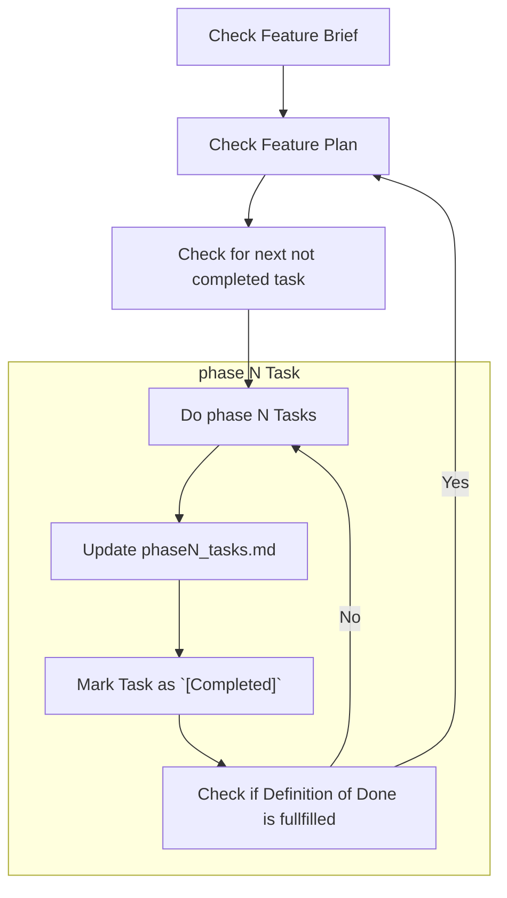

Your task is to implement each step of the provided plan, one at a time.

FIRST:
- Ask the user if you should proceed with the implementation on your own or if they want to review after each phase.

NEXT:
- Check current branch for active feature context
- Ask for user input if no feature context can be identified
- If a feature context is identified, proceed with the implementation plan

## Feature Implementation
- We must work through each task in phaseN_tasks.md first and then sequentially through the other files
- We are NOT finished until our Definition of Done or acceptance criteria is complete

## Feature Workflow

ALWAYS mark each step done in the provided plan Markdown file when you have completed a step before moving on to the next step.
Add [completed] to the end of the step description in the plan file.