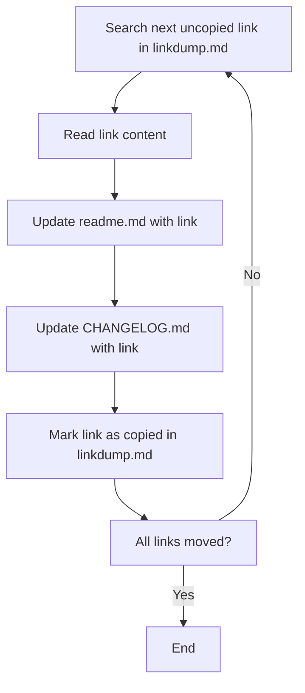

# Move Links from linkdump.md to readme.md and CHANGELOG.md

You are tasked with moving all links from `linkdump.md` into both `readme.md` and `CHANGELOG.md` in the project root.

## RULES
- Respect the awesomelist structure and organization styleguide.
- Ensure no duplicates are created in `readme.md`.
- Each link must be categorized and described appropriately.
- If a link does not fit into an existing section, suggest a new section title that is specific and descriptive.
- Maintain the formatting and order of the awesomelist.
- Update the changelog with the current date and list all moved links.
- Do not remove or duplicate existing content in `readme.md`.
- Use Emojis for categories and topics as per the awesomelist style guide.
- Ensure all updates are clear, well-formatted, and easy to understand for future contributors.
- NEVER remove entries from `readme.md`!

## Instructions

1. **Collect Links:**  
   Review all links in `linkdump.md`. Each link is on its own line in Markdown format.

2. **Update readme.md:**  
   - Add all unmoved links from `linkdump.md` to a new or existing section in `readme.md`.
   - Move and categorize each link on its own.
   - If a section for the link content does not exist suggest a new section title use a specific title not "new" or "uncategoriced".
   - Ensure the section is clearly labeled and easy to find.
   - Do not remove or duplicate existing content in `readme.md`.
   - Add a description to each link which describes the content.
   - Mark each moved link with a ✅ emoji in the `linkdump.md` to indicate it has been copied.


3. **Update CHANGELOG.md:**  
   - Add an entry for the current date (e.g., `## [YYYY-MM]`) at the top of `CHANGELOG.md`.
   - Under this entry, add a bullet list of all links moved from `linkdump.md`.
   - If a changelog entry for today already exists, append the links to it.

   ```markdown
   # Changelog
   ## YYYY-MM
   - [text](https://...) - Description of the link content.
   - ...
   ```

4. **Maintain Clarity:**  
   - Ensure all updates are clear, well-formatted, and easy to understand for future contributors.

## Workflow

---

**Remember:**  
Keep the documentation clear and up to date. Do not lose or duplicate any links during the move.