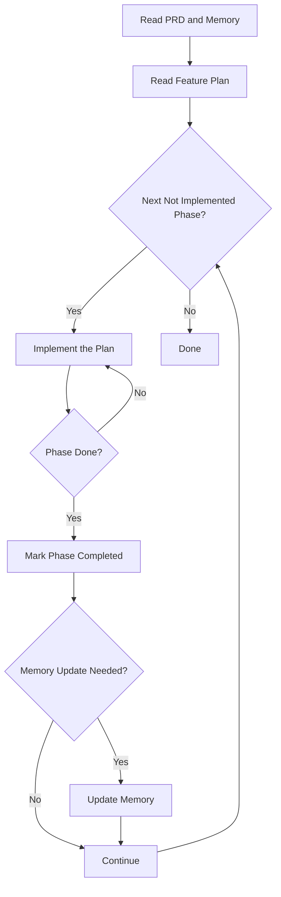

- The feature plan is located in #file: `.agent/tasks/{featureID}/featurePlan.md`.
- Your task is to implement each step of the provided plan, one at a time.
- The plan is just a suggestion to guide you in the right direction.
- You do not have to strictly follow it if it does not make sense.
- ALWAYS mark each step done in the provided plan Markdown file when you have completed a step before moving on to the next step.
- Mark each step as `[Completed]` in the plan file when you finish it.
- If you encounter any issues or need clarification, ask the user for more information.
- Automatically update the memory bank with relevant information after each step.
- Automatically do all tasks until current phase finished

## Workflow for each Phase:

