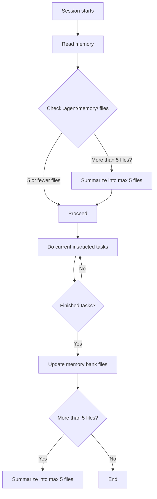

## Memory Bank

The memory bank is a persistent storage to keep track of the high level project architecture and active context you are working on.

RULES:
- The memory location is at `.agent/memory/`
- Keep the memory files lightweight and easy to reduce the context
- Document only high-level decisions, design, and active states
- Use Markdown files

IMPORTANT: Memory File Limit Rule
- At any point, if the number of files in `.agent/memory/` exceeds 5, you MUST immediately summarize and reduce the memory files to a maximum of 5 before proceeding with any other tasks.
- This rule takes precedence over all other instructions regarding memory management.
- Always check the number of files in `.agent/memory/` before and after any task or memory update.
- Do not wait for user instruction to summarize; act automatically.

WORKFLOW:
1. Check all existing files in `.agent/memory/`
2. If there are more than 5 files, summarize them into a maximum of 5 files before proceeding.
3. Do your current instructed tasks.
4. After finishing, update the memory bank files as needed.
5. If there are more than 5 files, summarize them into a maximum of 5 files.

Checklist:
- [ ] Checked `.agent/memory/` file count before and after tasks
- [ ] Summarized to max 5 files if needed, delete old files entirely
- [ ] Did not wait for user instruction to summarize

---

## Memory Bank Workflow

Do this workflow whenever you make changes to the project or the session starts

